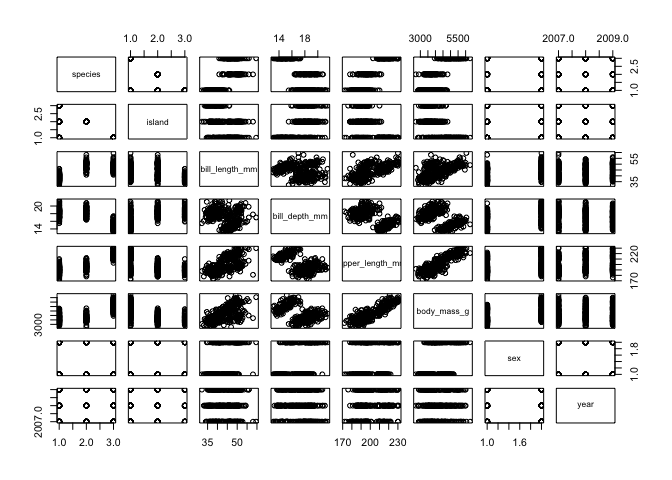
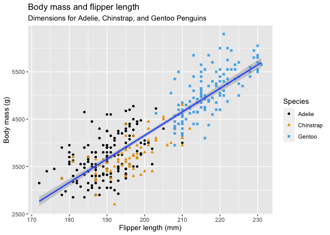

This is an [R Markdown](http://rmarkdown.rstudio.com) Notebook. When you execute code within the notebook, the results appear beneath the code. 

Try executing this chunk by clicking the *Run* button within the chunk or by placing your cursor inside it and pressing *Cmd+Shift+Enter*. 


```r
library(tidyverse)
```

```
## ── Attaching core tidyverse packages ──────────────────────── tidyverse 2.0.0 ──
## ✔ dplyr     1.1.4     ✔ readr     2.1.4
## ✔ forcats   1.0.0     ✔ stringr   1.5.1
## ✔ ggplot2   3.4.4     ✔ tibble    3.2.1
## ✔ lubridate 1.9.3     ✔ tidyr     1.3.0
## ✔ purrr     1.0.2  12   
## ── Conflicts ────────────────────────────────────────── tidyverse_conflicts() ──
## ✖ dplyr::filter() masks stats::filter()
## ✖ dplyr::lag()    masks stats::lag()
## ℹ Use the conflicted package (<http://conflicted.r-lib.org/>) to force all conflicts to become errors
```

```r
library(palmerpenguins)
library(ggthemes)
glimpse(penguins) 
```

```
## Rows: 344
## Columns: 8
## $ species           <fct> Adelie, Adelie, Adelie, Adelie, Adelie, Adelie, Adel…
## $ island            <fct> Torgersen, Torgersen, Torgersen, Torgersen, Torgerse…
## $ bill_length_mm    <dbl> 39.1, 39.5, 40.3, NA, 36.7, 39.3, 38.9, 39.2, 34.1, …
## $ bill_depth_mm     <dbl> 18.7, 17.4, 18.0, NA, 19.3, 20.6, 17.8, 19.6, 18.1, …
## $ flipper_length_mm <int> 181, 186, 195, NA, 193, 190, 181, 195, 193, 190, 186…
## $ body_mass_g       <int> 3750, 3800, 3250, NA, 3450, 3650, 3625, 4675, 3475, …
## $ sex               <fct> male, female, female, NA, female, male, female, male…
## $ year              <int> 2007, 2007, 2007, 2007, 2007, 2007, 2007, 2007, 2007…
```

Add a new chunk by clicking the *Insert Chunk* button on the toolbar or by pressing *Cmd+Option+I*.

When you save the notebook, an HTML file containing the code and output will be saved alongside it (click the *Preview* button or press *Cmd+Shift+K* to preview the HTML file). 

The preview shows you a rendered HTML copy of the contents of the editor. Consequently, unlike *Knit*, *Preview* does not run any R code chunks. Instead, the output of the chunk when it was last run in the editor is displayed.

```r
plot(penguins)
```

<!-- -->

```r
ggplot(
  data = penguins,
  mapping = aes(x = flipper_length_mm, y = body_mass_g)
) +
  geom_point(aes(color = species, shape = species)) +
  geom_smooth(method = "lm") +
  labs(
    title = "Body mass and flipper length",
    subtitle = "Dimensions for Adelie, Chinstrap, and Gentoo Penguins",
    x = "Flipper length (mm)", y = "Body mass (g)",
    color = "Species", shape = "Species"
  ) + scale_color_colorblind()
```

```
## `geom_smooth()` using formula = 'y ~ x'
```

```
## Warning: Removed 2 rows containing non-finite values (`stat_smooth()`).
```

```
## Warning: Removed 2 rows containing missing values (`geom_point()`).
```

<!-- -->

